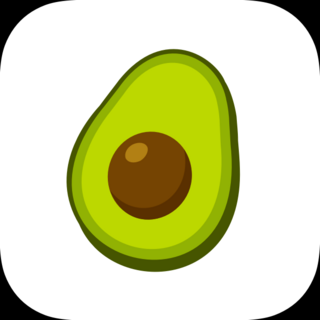

# AvocadoToast

    
  

## Description

AvocadoToast is an iOS app that allows a user to place a simple order for a slice of avocado toast. The app
uses a tab view that allows a user to place an order, with details such as adding toppings, changing quantity, 
and placing an egg. In addition, the user can see previously placed orders as well as details associated
with said orders. The app was written to test the power of SwiftUI and utilize its declarative format. 

AvocadoToast uses a custom app icon and custom assets - all created in this [Sketch project](https://github.com/mkKreations/AvocadoToast_Sketch)!

## Features

- Uses property wrappers to maintain property values and update UI 
- Uses small, reusable View components
- Allows user to drag image to desired location 
- Uses MVVM
- Light/Dark mode compatible

## App Icon

## Feedback

Any and all feedback is welcome - including pull requests.
